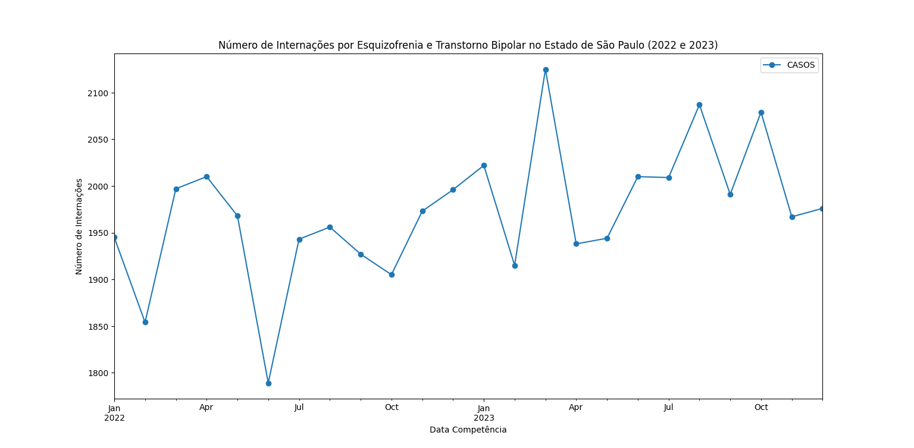
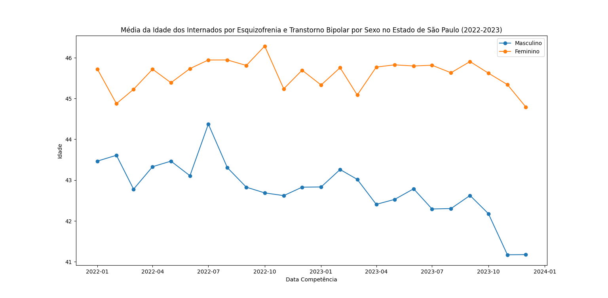
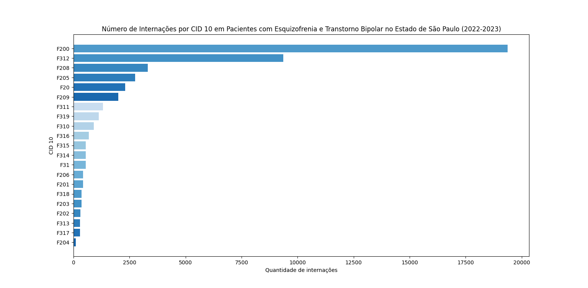
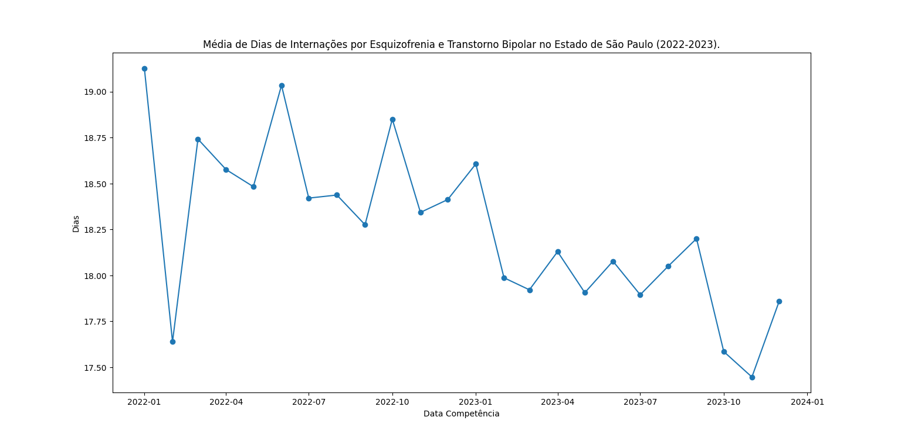
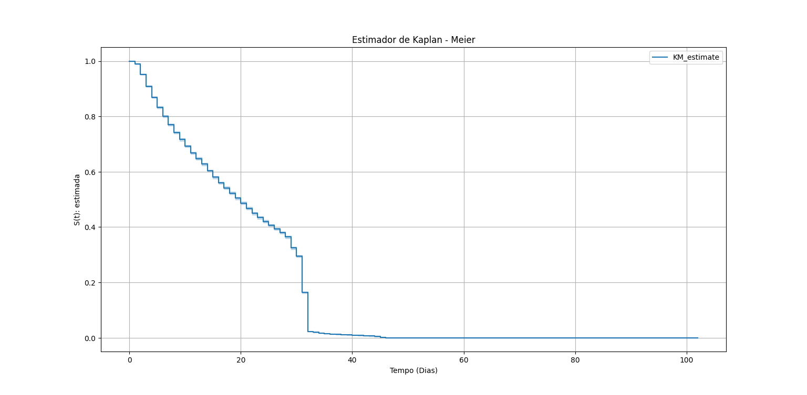
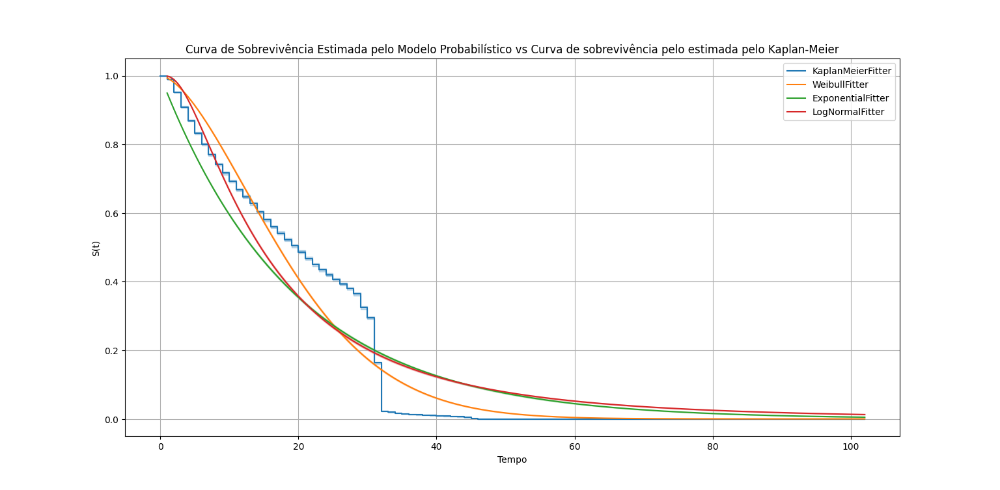
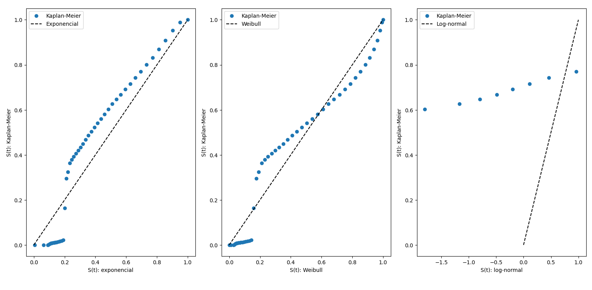
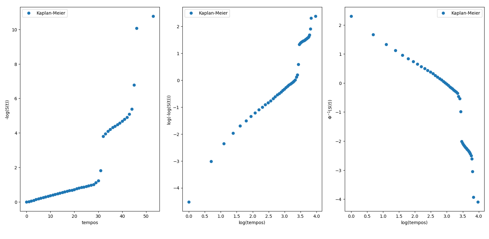

# Análise da Duração da Internação em Pacientes com Transtorno Bipolar e Esquizofrenia no Estado de São Paulo (2022-2023)

###### Fontes dos Dados: [DataSUS](https://datasus.saude.gov.br/transferencia-de-arquivos/)

O objetivo do estudo é análisar o tempo de internação de pacientes com transtorno bipolar e esquizofrenia no Estado de São Paulo entre os anos de 2022 e 2023.

A metodologia utilizada no estudo foi a **Análise de Sobrevivência**, que consiste em estudar o tempo até a ocorrência de um evento. Um estudo utilizando a análise de sobrevivência é basicamente estruturado pelo tempo de falha e a censura. O tempo de falha é caracterizado pelo evento de interesse, ou seja, a falha. Para o estudo em questão, a falha é a exposição do paciente desde a sua internação até a sua saída. A escala de medida também é importante definir em um estudo de análise de sobrevivência. A escala pode ser em dias, meses, anos. Em estudos de engenharia, a escala pode ser definida pelo número de ciclos, quilometragem de um carro ou outra medida, para o estudo a escala de medidas é em dias. E por último a censura, que é a presença de informações incompletas ou parciais. Existem diversos motivos que um estudo pode gerar censura, como a morte de um paciente, se o acompanhamento de um paciente foi interrompido, entre outros. Para o estudo, o óbito do paciente foi tratado com censura.

###### Resumo:
1. Tempo de falha: Tempo de internação (em dias).
2. Censura: Morte do paciente.

 
Antes de aplicarmos qualquer modelo ou técnica de machine learning, é essencial realizar uma análise exploratória dos dados. O objetivo dessa etapa é obter um entendimento mais profundo sobre o conjunto de dados que estamos analisando, além de criar hipóteses e extrair insights relevantes para embasar a tomada de decisões.

  

O gráfico abaixo apresenta o número de internações por esquizofrenia e transtorno bipolar no Estado de São Paulo entre 2022 e 2023. Uma das interpretações desse gráfico é que o diagnóstico preciso de pacientes com transtorno bipolar pode levar de 5 a 10 anos, enquanto para pacientes com esquizofrenia, a média é de 2 anos para fechar um diagnóstico. Além disso, o tempo mínimo para ser “aceito” como esquizofrenia é de 6 meses. Essa diferença no tempo de diagnóstico pode influenciar os números de internações, indicando que o total de casos por mês pode ser ainda maior. Vale ressaltar que ambos os transtornos possuem sintomas semelhantes e podem ser confundidos, tornando seus diagnósticos bastante complexos.

 

Em ambos trantornos, os sintomas (manias, delírios, alucinações, aumento da energia,insonia,etc) podem se manifestar entre 15 a 35 anos. Nas mulheres os sintomas começam a aparecer entre 25 a 35 anos, já nos homens, os sintomas se iniciam cedo, entre 15 a 25 anos. Porém, o diagóstico é bem tardio, a média da idade do diagnótico é de 45 anos. No gráfico abaixo isso é mostrado, nas mulheres a média da idade do diagnostico é de 45 anos, já para os homens a idade média é entre 41 a 43 anos.

 

Os cid's (Classificação Estatística Internacional de Doenças e Problemas Relacionados com a Saúde) que mais apresentaram casos de internções foram o **F20.0 - Esquizofrenia paranóide** com 19369 e **F31.2 - Transtorno afetivo bipolar, episódio atual maníaco com sintomas psicóticos** com 9357. Lembrando que existem vários tipos de esquizofrenia e bipolaridade. 

 
 

O tempo de internação de um paciente com esquizofrenia e transtorno de bipolaridade depende muito da gravidade do quadro clínico e das necessidades individuais do paciente. Porém, para o estudo em questão tempo médio de internação é de 18 dias. Com o passar do tempo, de acordo com o gráfico, o tempo médio de internação tende a diminuir.

Com base na análise exploratória de dados realizada, podemos aplicar os conceitos de **Análise de Sobrevivência** aos dados.

 

## Análise de Sobrevivência:
* ### Estimador de Kaplan - Meier
   O estimador não - paramétrico de Kaplan - Meier tem como objetivo de estimar a função de sobrevivência.
 

  $\hat{S}(t) = \prod_{i:t_i \leq t} \left(1 - \frac{d_i}{n_i}\right) $ em que,

 

+ $\ t_1 < t_2 < ... <t_k$, os k tempos distintos e ordenados de falha.

+ $\ d_i$ : número de falhas em $\ t_i, i = 1,...,k$.

+ $\ n_i$ : número de indivíduos sob risco em $\ t_i$, ou seja, os indivíduos que não falharam e não foram censurados até o instante imediatamente anterior a $\ t_i$.

 

  No estimador de kaplan-meier abaixo mostra que, o número de pacientes      diminui a medida que os dias de internação avançam.

   

Logo, o tempo médio de dias de internação de pacientes que possuem esquizofrenia e transtorno de bipolaridade é de 20 dias.

 

$\hat{t_m} = t_1 + \sum_{j = 1}^{k-1} \hat {S}(t_j)(t_{j+1} - t_j) = 20,27$ dias de internação.

Para o tempo mediano, 50% dos pacientes ficam 20 dias internados.
  

* ### Modelagem Probabilística em Análise de Sobrevivência.

  O objetivo dos modelos probabilísticos é estimar o tempo de duração ou tempo até que um evento de falha ocorra. Os modelos que serão aplicados nos dados serão:

  1. Exponêncial: $\ S(t) = e^{-(\frac{t}{\lambda})} $.
  2. Weibull: $\ S(t) =  e^{-(\frac{t}{\alpha})^{\gamma}} $.
  3. Log - Normal: $\ S(t) = \Phi( \frac{-log(t) + \mu}{\sigma})$.

  

Para os dados em questão, foram ajustados três modelos probabilísticos:exponêncial, weibull e log-normal:

Exponêncial: $\ S(t) = e^{-(\frac{t}{19.27})} $

Weibull: $\ S(t) =  e^{-(\frac{t}{21.42})^{1.65}} $

Log - Normal: $\ S(t) = \Phi( \frac{-log(t) + 2.67}{0.87})$

A fim de determinar se os dados se ajustam a essas distribuições mencionadas, devemos seguir os seguintes passos:

1. Se a curva do modelo probabilistico estiver próxima ou rente a estimador de Kaplan-Meier, o modelo pode ser um forte candidato para estar ajustado aos dados. 
 

 

2. O próximo passo é construir Gráfcos das sobreviv^encias estimadas por Kaplan-Meier versus as sobrevivências estimadas pelos modelos ajustados. Se a curva estiver próxima da reta $\ y = x$, podemos dizer que modelo também é um forte candidato para estar ajustado aos dados. Isso indica que o modelo está capturando bem o comportamento de sobrevivência observado nos dados.
 

 

3. No terceiro passo, devemos construir o gráfico linearizados para os modelos exponencial, Weibull e Log-Normal. Assim, devemos olhar novamente se a curva está próxima da reta $\ y = x$.

Por último, foi calculado o log da verossimilhança para os três modelos:
  | Exponência| Weibull| Log - Normal|
  | -------- | -------- | -------- |
  | -187038.62 | -180265.05 |-187024.82 |

Portanto, com base nos testes realizados de forma gráfica e na verossimilhança logarítmica, o modelo que melhor se ajusta aos dados de tempo de internação de pacientes que tiveram esquizofrenia e transtorno bipolar é o modelo **Weibull**.:

$\ S(t) =  e^{-(\frac{t}{21.42})^{1.65}} $

#### Referência: 
[DataSUS](https://datasus.saude.gov.br/transferencia-de-arquivos/)

[Artigo](https://www.scielo.br/j/reeusp/a/XkYNj8HPhM7SWFFPpwvM8Hg/?format=pdf&lang=pt)

[freeCodeCamp](https://www.freecodecamp.org/news/how-to-use-markdown-in-vscode/)

[TeoMeWhy - Guithub](https://github.com/TeoMeWhy)

[TeoMeWhy - Twitch.tv (DataSUS)](https://www.twitch.tv/collections/E82inP8ZcRfmWg)

Análise de Sobrevivência Aplicada - Enrico Antônio Colosimo e Sueli Ruiz Giolo
